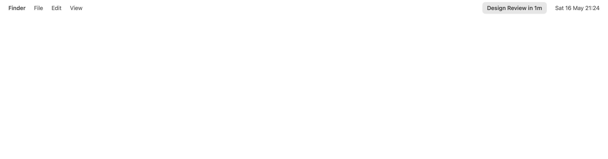
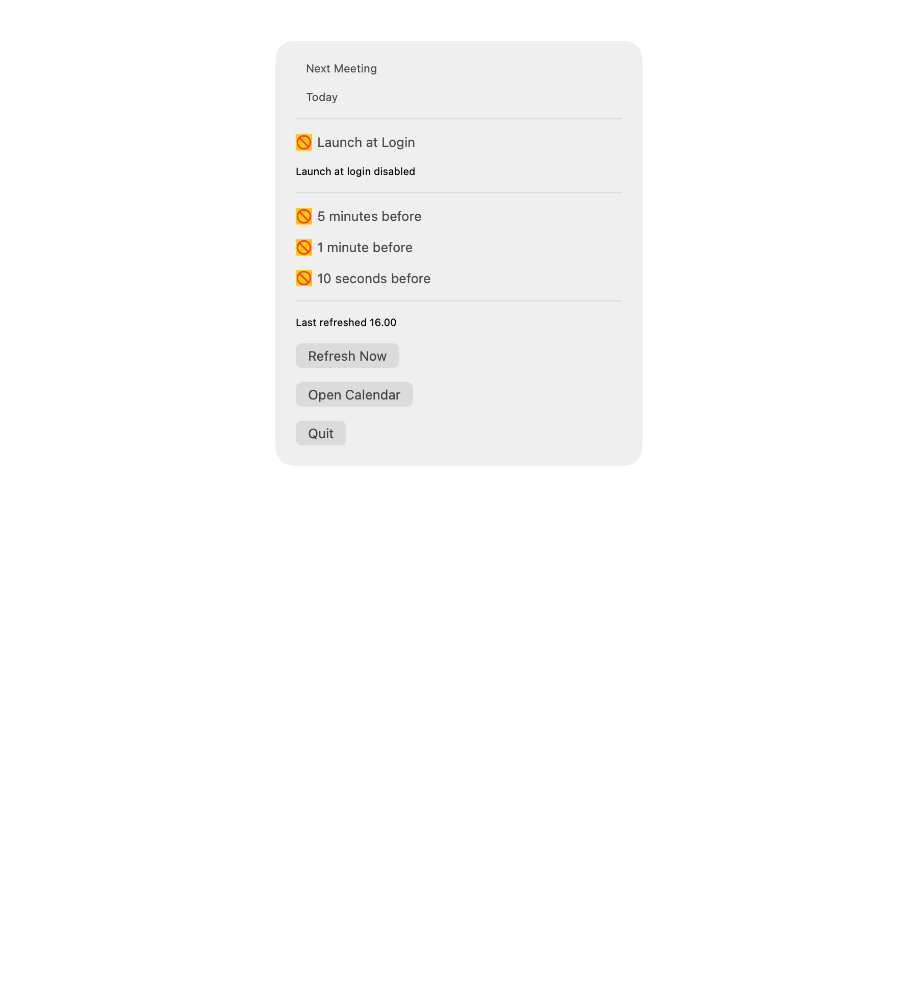
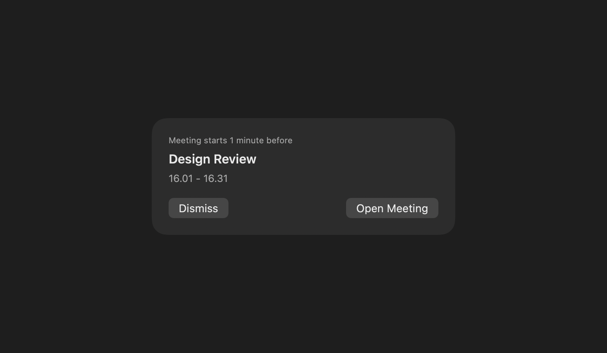

# Meeting Reminder


Minimal macOS menu bar app for upcoming meeting reminders.

The app reads events from the local macOS Calendar database through EventKit. It does not connect directly to Google Calendar. To use it with Google Calendar, add your Google account in macOS Internet Accounts or Calendar first, then make sure the events appear in the built-in Calendar app.

## Why This Exists

Calendar notifications are easy to miss when you are focused. Meeting Reminder keeps the next meeting visible in the menu bar and can show a small popup shortly before the meeting starts.

The app is intentionally local-first: no Google OAuth, no backend, no analytics, and no calendar sync logic of its own.

## Screenshots

The images below are generated from the app's SwiftUI screenshot renderer with demo data, so they avoid exposing private calendar details.







## Features

- Shows the next meeting in the macOS menu bar.
- Lists today's upcoming non-all-day events in the menu dropdown.
- Sends local notifications at 10 minutes before, 5 minutes before, and meeting start.
- Shows a custom popup before meetings.
- Supports configurable popup offsets from the menu bar, defaulting to 5 minutes and 1 minute before meeting start.
- Supports a 10-second-before popup option.
- Popup `Open Meeting` opens the detected meeting link in the default browser.
- Includes launch-at-login control from the menu bar.
- Includes a custom app icon.
- Refreshes every 10 seconds and when macOS reports calendar changes.
- Builds to a local `.app` bundle and versioned `.dmg`.

## Requirements

- macOS 14 or newer.
- Xcode command line tools for source builds.
- Calendar access permission.
- Notification permission.

## Download

For normal use, download the latest DMG from GitHub Releases and drag the app to `Applications`.

Current local release artifact:

```text
dist/MeetingReminder-0.3.0.dmg
```

## Build

```bash
swift build
```

## Run As App Bundle

```bash
./scripts/build-app.sh
open "dist/Meeting Reminder.app"
```

The raw SwiftPM executable is not the recommended way to run the app because macOS privacy prompts depend on the app bundle metadata in `Resources/Info.plist`.

## Build DMG

```bash
./scripts/build-dmg.sh
```

The DMG is created at:

```text
dist/MeetingReminder-0.3.0.dmg
dist/MeetingReminder.dmg
```

The versioned file is the release artifact. `MeetingReminder.dmg` is a latest-build alias for quick local installs.

## Install

Open the DMG, then drag `Meeting Reminder.app` to `Applications`.

Launch-at-login works best after the app is installed in `Applications`.

## Permissions

On first launch, macOS should ask for Calendar and Notification access. If you deny access, enable it again from System Settings:

```text
System Settings > Privacy & Security > Calendars
System Settings > Notifications
```

During development, you can reset Calendar permission for this bundle ID:

```bash
tccutil reset Calendar com.iqbaldp.meeting-reminder
```

## Privacy

Meeting Reminder reads calendar events through Apple's EventKit framework. It does not send calendar data anywhere.

The app does not:

- Use Google Calendar API directly
- Ask for Google OAuth credentials
- Run a backend service
- Include telemetry or analytics
- Upload meeting titles, attendees, links, notes, or times

Local settings are stored with `UserDefaults`. See [Privacy](docs/privacy.md) for details.

## Popup Reminders

Popup reminders are controlled from the menu bar under `Popup`.

Default enabled offsets:

```text
5 minutes before
1 minute before
```

Available offsets:

```text
10 minutes before
5 minutes before
1 minute before
10 seconds before
At meeting start
```

The app remembers popup settings locally through `UserDefaults`.

When a meeting link is available in the event URL, location, or notes, the popup shows `Open Meeting` and opens it with the default browser. Known meeting links such as Google Meet, Zoom, and Microsoft Teams are preferred over generic calendar URLs.

## Launch At Login

Use the menu bar item:

```text
App > Launch at Login
```

macOS may require approval from System Settings depending on the app location and system policy.

## Distribution Notes

The scripts use ad hoc signing for local testing. A GitHub DMG built this way can still trigger macOS Gatekeeper warnings on other machines.

For smoother public distribution outside the App Store, use an Apple Developer ID certificate and notarize the app before publishing the DMG.

## Development

Useful commands:

```bash
swift test
./scripts/build-app.sh
./scripts/build-dmg.sh
./scripts/check-release.sh
```

See [Contributing](CONTRIBUTING.md) for scope and development notes.

## Known Limits

- Google Calendar must already be synced into macOS Calendar.
- No direct Google Calendar API support.
- Notification offsets are not configurable yet.
- Builds are ad hoc signed unless you add Developer ID signing and notarization.
